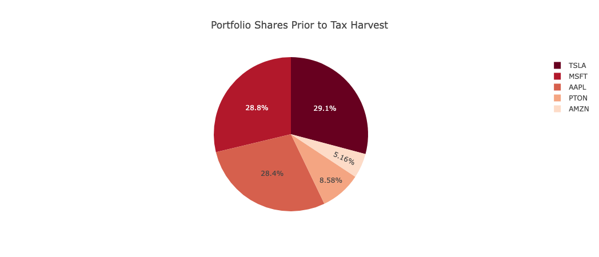
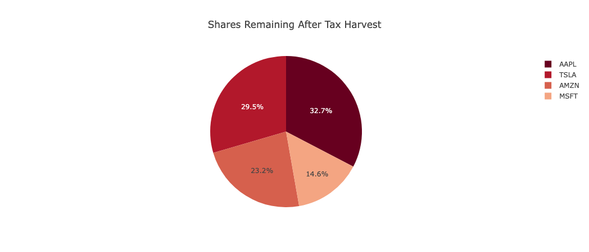
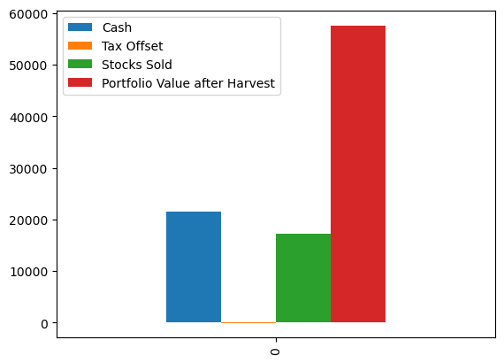

# group_project_1

## November 22, 2022

## Collaborators
Andres and Jerami

# project title
Tax Harvest Advisor

# team members
Andres and Jerami

# project description
an application to help evaluate tax impact of sell decisions of your current portfolio.
gives recommendations to what to sell.
provide portfolio analysis.

# reseach questions to answer
n/a

# datasets to be used
stock ticker data
user provided data

# rough break down of tasks
1. genrate portofolio by allowing user to input purchase date, ticket, shares, price into app
2. display portfolio balance by symbol up to date info provided by api
3. determine if asset would be short term or long term capital gain
4. ask user how much liquidity they'd like to gain from portfolio to either cash out or rebalance
    a. provide sell recommendation by symbol and shares and current price
5. any new stocks purchased added to the portfolio
6. portfolio analysis
    a. forcasting - monte carlo
    b. trend
    c. correlation
    d. distribution
    e. beta
    f. sharpe
    g. profit/loss
    h. standard deviation
7. 